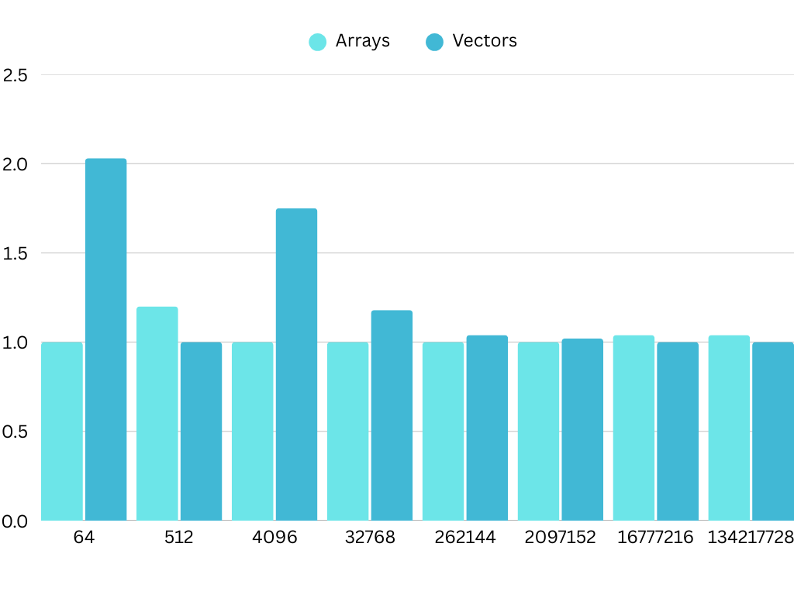
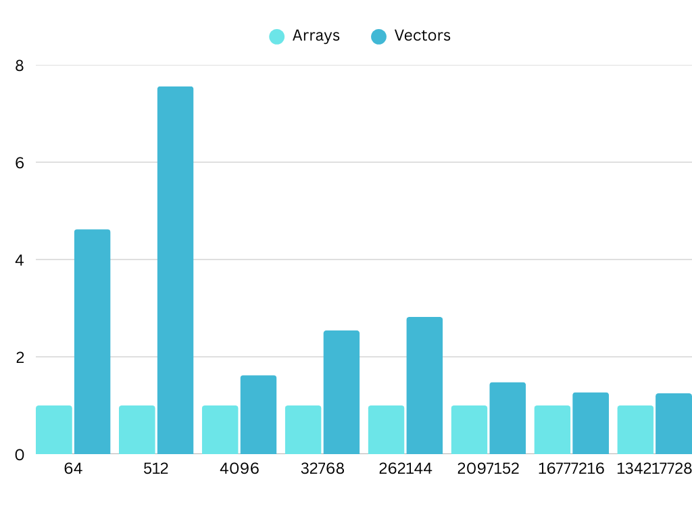
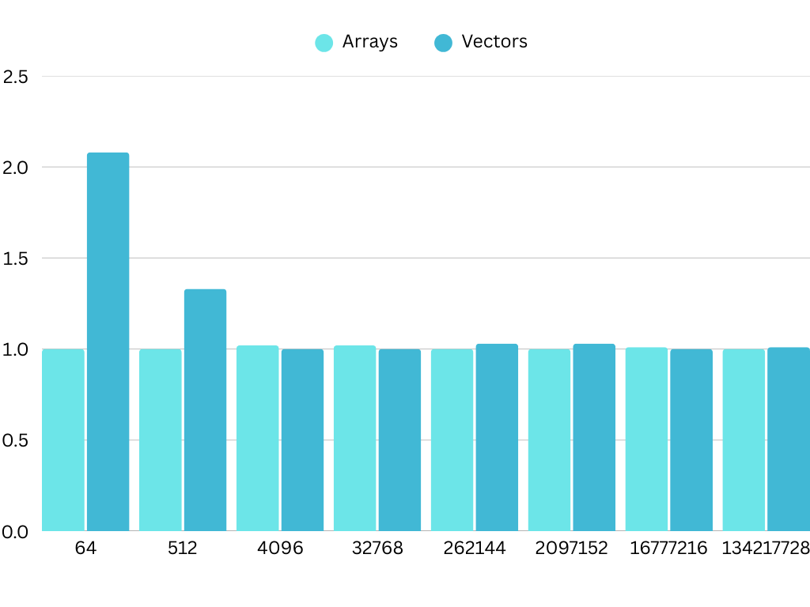

= Java 24 Vector API

Performance testing Java 24's Vector API.

== Test Harness:

JavaVectorAPI-1:
https://github.com/tomerr90/JavaVectorAPI-1.git

== Test Design:

Using JDK 24 we will run all five test suites from JavaVectorAPI-1 on a different CPU vendor:

* Intel Xeon E-2378
* AMD Ryzen 9 9950x
* Apple M4 Base
* Qualcomm SnapDragon X Elite X1E80100

== Test Results:

=== Intel Xeon E-2378

SimpleSum:

SimpleSumNoSuperWord:

ComplexExpression:

ComplexExpressionNoSuperWord:

image::./assets/images/Xeon-ComplexExpressionNoSuperWord.png[alt=ComplexExpressionNoSuperWord,width=480,height=640,align="center"]

=== AMD Ryzen 9 9950x

=== Apple M4 Base

=== Qualcomm SnapDragon X Elite X1E80100
